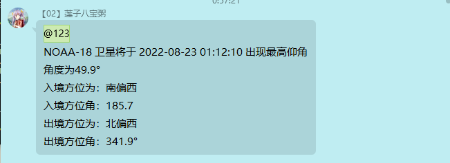
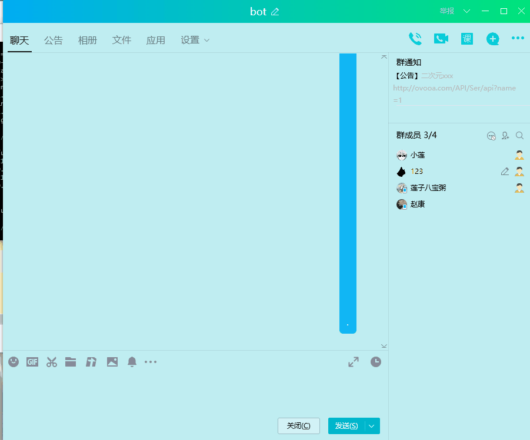
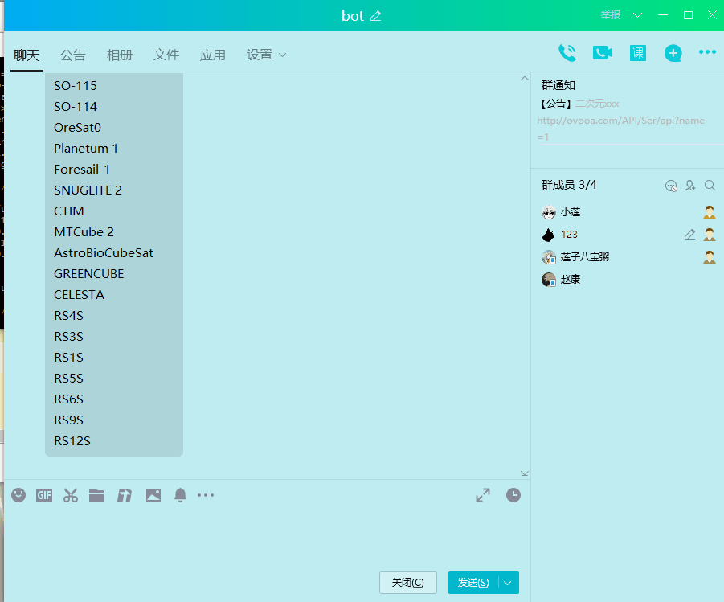
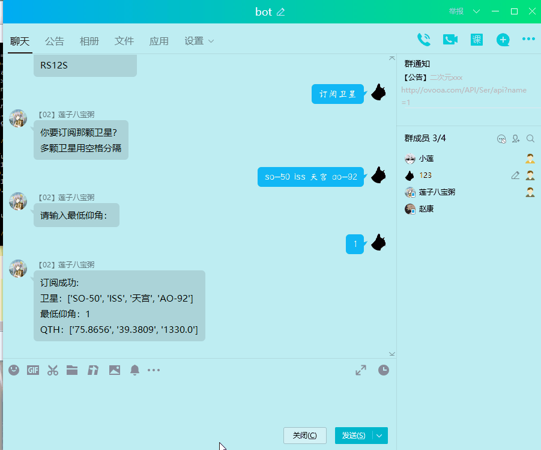
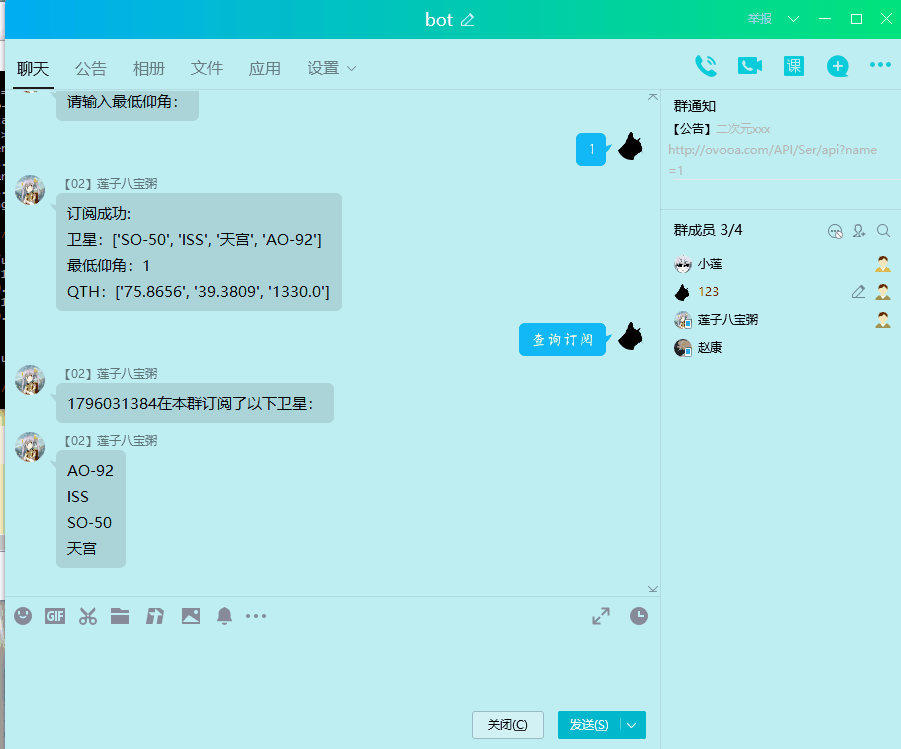
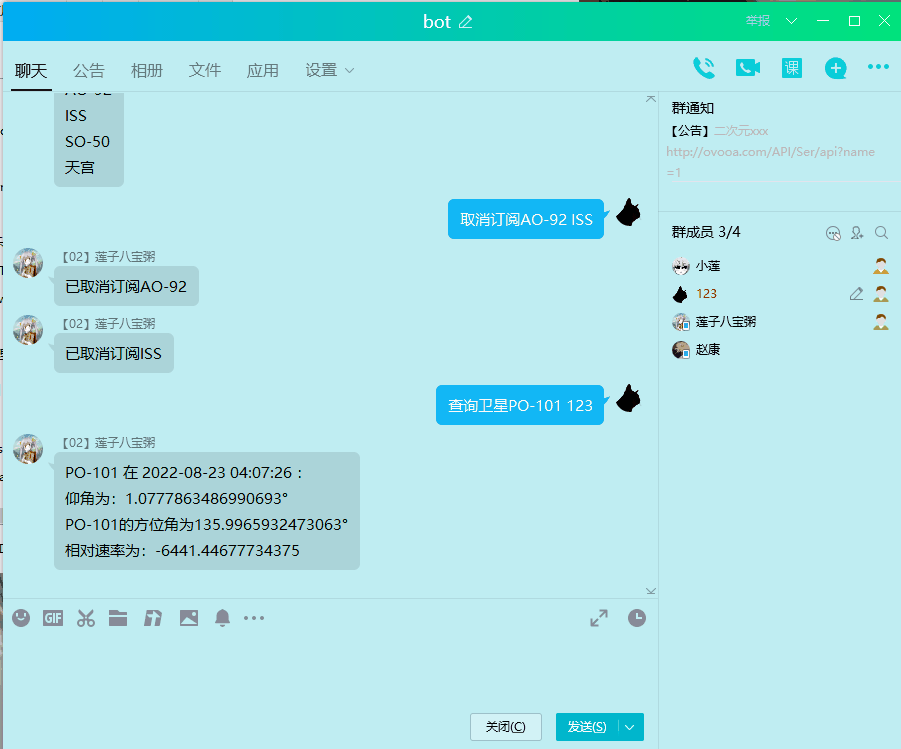

<div align="center">

**你的star是我的动力**
**↓**


# HAM助手

_✨ NoneBot2 业余无线电插件✨ _

</div>

<details>
  <summary> <h3>点击查看目录</h3></summary>


- [HAM助手](#ham助手)
  - [安装](#安装)
    - [直接安装](#直接安装)
    - [pip安装](#pip安装)
    - [nb-cli安装  【推荐】](#nb-cli安装--推荐)
  - [说明](#说明)
    - [追星](#追星)
      - [数据来源](#数据来源)
      - [使用时](#使用时)
      - [刷题](#刷题)
  - [功能](#功能)
  - [指令](#指令)
    - [绑定QTH:  【群内、私聊】](#绑定qth--群内私聊)
    - [订阅卫星：  【群内】](#订阅卫星--群内)
    - [查询订阅的卫星 【群内】](#查询订阅的卫星-群内)
    - [查询支持的卫星列表 【群内、私聊】](#查询支持的卫星列表-群内私聊)
    - [查询某卫星在指定分钟后的状态 【群内、私聊】](#查询某卫星在指定分钟后的状态-群内私聊)
    - [取消订阅卫星  【群内】](#取消订阅卫星--群内)
    - [取消当前操作](#取消当前操作)
    - [网格 【私聊、群内】](#网格-私聊群内)
    - [考题](#考题)
      - [刷题 【私聊、群内】](#刷题-私聊群内)
  - [TODO](#todo)
  - [参考资料](#参考资料)

</details>

## 安装

### 直接安装

**拉取仓库放入机器人文件夹**
**然后安装本项目依赖**

```bash
pip install -r requirements.txt
```

### pip安装

先安装包

```bash
pip install nonebot-plugin-cqsat
```

再进入`bot.py`
加入以下代码

```python
nonebot.load_plugin("cqsat")
```

### nb-cli安装  【推荐】

打开机器人项目文件夹（bot.py同级目录）
执行

```bash
nb plugin install nonebot-plugin-cqsat
```

## 说明

### 追星

#### 数据来源

- 目前只支持来自[https://amsat.org/tle/current/nasabare.txt](https://amsat.org/tle/current/nasabare.txt)的数据
- 还支持中国空间站，中国空间站TLE数据来自[中国载人航天官方](http://www.cmse.gov.cn/gfgg/zgkjzgdcs/)

#### 使用时

**- 对于中国空间站，在使用时建议用`天宫`**

- 目前每次查询都是从在线获取数据
- 每分钟检测一次
  - 检测当前时间10分钟后，用户所定阅卫星的情况
  - 如果十分钟后入境，并且从入境到出境期间出现的最高仰角大于用户设定的最低仰角，将在群内@用户并提示
- 在执行输入操作时，输入`取消` 或者 `算了` 可取消当前操作

#### 刷题

当前题目版本：_v20211022_  
题目来源：[CRAC官网](http://crac.org.cn/News/Detail?ID=3dbd1bc7f36443958e1872234f42464f)  
根据官方题目生成的json文件位于：/cqsat_resource/bank 下

## 功能

- 追星
  - 提示示例：

<details>
  <summary> <h3>点击查看截图</h3></summary>



</details>

## 指令

### 绑定QTH:  【群内、私聊】

- 绑定时发送：`绑定位置`
- 更改位置时同样发送：`绑定位置`
- 需要输入
  - 地名
    - 例如：`北京`
  - `经度 纬度 海拔`(以空格分隔)
    - 例如：  75.8656 39.3809 1330.0

<details>
  <summary> <h3>点击查看截图</h3></summary>



</details>

### 订阅卫星：  【群内】

订阅时发送：`订阅卫星`期间会让用户输入：

- `卫星名称`:  大小写不敏感(多卫星用空格分隔)
  - 例如：SO-50 ISS ao-92
- `最低仰角`:  输入数字（1, 90] （允许输入`xx度`或`xx°`）
  - 例如 10

<details>
  <summary> <h3>点击查看截图</h3></summary>



</details>

### 查询订阅的卫星 【群内】

- 发送  `查询订阅`

<details>
  <summary> <h3>点击查看截图</h3></summary>



</details>

### 查询支持的卫星列表 【群内、私聊】

- 发送`卫星列表`

<details>
  <summary> <h3>点击查看截图</h3></summary>


</details>

### 查询某卫星在指定分钟后的状态 【群内、私聊】

- 发送  `查询卫星+卫星名+ +分钟数`  卫星名和分钟数用空格分隔
  - 例如 查询卫星SO-50 50  （查询so-50在50分钟后的状态）
- 或 `计算卫星+卫星名+ +分钟数` 卫星名和分钟数用空格分隔

<details>
  <summary> <h3>点击查看截图</h3></summary>


</details>

### 取消订阅卫星  【群内】

- 发送`取消订阅+卫星名称` 多颗卫星用空格分隔
  - 例如：取消订阅 SO-50 ISS ao-92

<details>
  <summary> <h3>点击查看截图</h3></summary>



</details>

### 取消当前操作

- 在问答过程中发送`取消` 或者 `算了` 可取消当前操作

<details>
  <summary> <h3>点击查看截图</h3></summary>



</details>

### 查看相关网页截图
- 发送`/s` 即可查看相关网站的截图 例如 `/s t a`
  - t https://www.df2et.de/tevel/ 
  - a https://amsat.org/status/index.php
  - css https://sathunt.com/
  - home https://github.com/yzyyz1387/cqsat
  - [ ]...
  - 机器人superuser可使用/截图指令

### /截图
- 机器人superuser可使用/截图指令
  - `/截图 add url=xxx path=xxx cmd=xx,xxx proxy=xxx **kwargs`
    - url: 截图网址
    - path: 截图保存路径
    - cmd: 截图命令
    - kwargs: 其他参数
    - 若要使用代理，请在机器人`.env.*`配置`sat_proxy_url=http://xx:port`
  - `/截图 del url=xxx path=xxx cmd=xxx`
    - url /path /cmd 其中之一即可
  - `/截图 get`
    - 查看当收录的截图支持列表
  - `/截图 default`
    - 恢复默认

### 计算卫星过境交集
- 此功能可以预测两个网格之间的卫星过境通联交集
- 发送`/约  卫星1,卫星2 网格1 网格2` 即可查看卫星过境交集 例如 `/计算 so-50,iss OM44 OM48`
  - 也可使用 `/匹配`、 `/satmatch`
  - 当用户只发送了一个网格时，会自动使用用户绑定的网格，如果用户没有绑定位置，会发出提示

### 娱乐信令
- 发送`/v` ，根据提示回复一条语音，即可对该语音加上信令音
- 可选参数
  - `-p` 加前置音 例如：`/v -p`
  - `-n[数字]` 加噪音 例如：`/v -n5`
  - 使用示例: `/v -n5 -p` 

## 新增针对卫星夜间免打扰：
- 发送 `订阅卫星` 重新订阅一遍，在订阅的时候设置，**此版本前订阅的将默认开启**，默认时间为20:00--08:00
- 设置订阅时间：发送 `设置免打扰 时间起  时间止` 例如：`设置免打扰 20 8`
- 开启/关闭 本群免打扰：发送 `设置免打扰`

全局免打扰：
- 设置全局免打扰时间： `全局免打扰 时间 时间`，例：`全局免打扰 20 8`
- 开启/关闭全局免打扰： `全局免打扰

### 网格 【私聊、群内】

- 发送 `我的网格` 查询用户绑定qth的网格
- 发送 `计算网格 +地名` 计算指定地址的网格，如 `计算网格 北京`
- 发送 `计算网格+经度+  +纬度` 计算指定位置的网格 经纬度用空格分隔
  - 不加经纬度相当于 `我的网格` 指令

<details>
  <summary> <h3>点击查看截图</h3></summary>


</details>

### 考题

#### 刷题 【私聊、群内】

- 发送 `刷题` 开始顺序刷题
- 发送 `取消` 、 `退出` 取消当前刷题

#### 考试
- 发送`HAM考试` 、`h考试` 开始考试
- 考试过程中发送 `时间` 可查看考试剩余时间
- 考试过程中发送 `退出` 可退出考试
- 做完题目自动交卷
- 规定时间内未做完题目自动交卷
- 交卷后可查看考试结果及分析

- 发送 `我的错题` 可查看错题
- 发送 `查题 + 级别 + 题号` 可查看指定题目
  - 例如 `查题 A 1` 查看A类考试第一题

<details>
  <summary> <h3>点击查看截图</h3></summary>


</details>

[//]: #
[//]: #
[//]: #
## TODO

- [X]  追星
- [X]  相关计算
- [X]  刷题
- [ ]  刷题错误记录、常错记录
- [ ]  模拟考试
- [ ]  卫星状态、卫星列表加入图片支持
- [ ]  [#5](https://github.com/yzyyz1387/cqsat/issues/5)

## 参考资料

[PyEphem Home Page — PyEphem home page (rhodesmill.org)](https://rhodesmill.org/pyephem/)

刁宁辉,刘建强,孙从容,等. 基于SGP4模型的卫星轨道计算[J]. 遥感信息,2012,27(4):64-70. DOI:10.3969/j.issn.1000-3177.2012.04.011.
